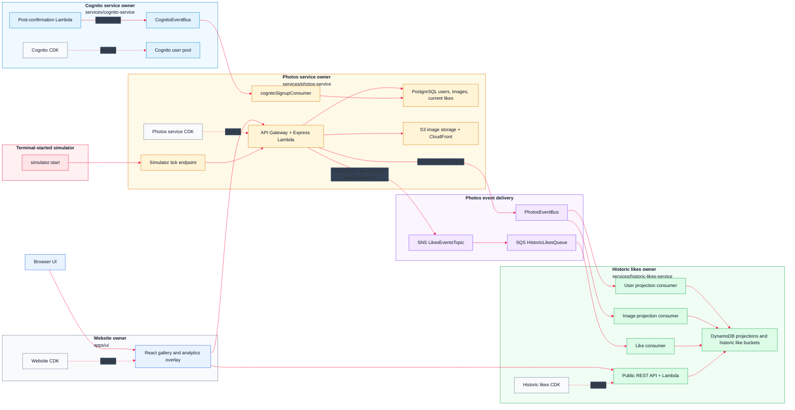

# AWS 07 - Historic Likes Microservice

## Introduction

AWS 07 is the point where the application becomes a real microservices system. The single `api` service from the previous database lesson is now the `photos-service`, and it sits alongside independently deployable `cognito-service` and `historic-likes-service` owners. Each service carries its own runtime code, scripts, and CDK app, so the AWS resources in the stack now have a clear home instead of being managed from one central infrastructure folder.

The new user-facing feature is photo liking. The photos service records the current like state in PostgreSQL and returns it to the gallery, while the historic likes service builds longer-term charts and tables for likes by image and by author. Those services do not share a database. When historic likes needs photo or user context owned by the photos service, that data is projected across event queues and stored in the historic service's own DynamoDB tables.

The historic likes service is deliberately shaped differently from the photos service. It is still TypeScript, but it is a set of Lambda handlers using API Gateway proxy events directly rather than an Express application, and it uses DynamoDB read models instead of the photos service's PostgreSQL schema.

## Mermaid Diagram



## Release Notes

- **Service-owned architecture.** The previous central `cdk` package has been split into service-local CDK apps. Website hosting lives with `apps/ui`; Cognito resources live with `services/cognito-service`; the photo API, RDS database, image bucket, image CloudFront distribution, photo event bus, likes topic, seed scripts, and simulator live with `services/photos-service`; historic analytics resources live with `services/historic-likes-service`.
- **The old API is now the photos service.** The former `services/api` boundary has been renamed and narrowed to `services/photos-service`, which better reflects what it owns: photos, users known to the app, uploads, current likes, image storage, and photo-domain events.
- **A new historic likes microservice.** `services/historic-likes-service` is a separate TypeScript service with its own CDK stack, public REST API, SQS consumers, DynamoDB tables, reset script, and public API test script. Unlike the photos service, its HTTP entry point handles API Gateway proxy events directly rather than running through Express.
- **Independent data ownership.** The photos service keeps operational data in PostgreSQL tables such as `registered_user`, `images`, and `image_likes`. The historic likes service keeps its own DynamoDB projections and aggregate tables. It does not reach into the photos database.
- **Event-projected users and images.** User and image changes owned by the photos service are published to `PhotosEventBus`. The historic likes service subscribes through SQS queues and stores local user and image projection rows so analytics can be resolved without a cross-service database query.
- **Like event fan-out.** Like and unlike actions are published to `LikesEventsTopic` as `like.created` and `like.deleted`; simulator resets publish `likes.deleted.all`. In this release the historic likes service is the subscriber, and the SNS topic leaves room for later services to join the same stream.
- **Current likes in the gallery.** Signed-in users can like and unlike photos. The photos service records the current state in `image_likes`, and gallery responses include whether the current user has liked each photo.
- **Historic charts and tables.** The UI can show accumulated historic activity by image and by author. The historic likes service stores 5-second bucket aggregates in DynamoDB and serves public endpoints for overview tables and per-entity charts.
- **Repeatable demos and cleanup.** Seed, reset, and simulator scripts now live with the services that own the data. `data:seed` creates artwork authors and images, `simulator:start` creates like traffic from viewer users, and `data:reset` clears photos, historic projections, and Cognito test data in the right order.

## How To Run

Most day-to-day work starts in the `monorepo` folder. The root scripts are thin wrappers around service-owned scripts, so you can either run the whole stack or step into one owner when you want to inspect something more closely.

**Install and local checks**

```bash
cd monorepo
pnpm install
pnpm -C services/photos-service run dev
pnpm -C apps/ui run dev
pnpm run type-check
```

**Deploy the backend services**

```bash
pnpm run bootstrap-up
pnpm run cognito-service:deploy
pnpm run photos-service:deploy
pnpm run historic-likes-service:deploy
```

**Deploy the UI**

```bash
pnpm run website:deploy
pnpm run ui:url
```

**Deploy everything in the expected order**

```bash
pnpm run deploy-everything
```

**Seed, reset, and simulate activity**

```bash
pnpm run data:seed          # upload starter images and publish image events
pnpm run simulator:start    # create like/unlike traffic from terminal users
pnpm -C services/photos-service run simulator:latest
pnpm run data:reset         # clear photos data, historic projections, and Cognito test users
```

**Useful service tests**

```bash
pnpm -C services/photos-service run test:security
pnpm -C services/historic-likes-service run test:public-api
```

**Tear down**

```bash
pnpm run destroy-everything
pnpm run bootstrap-down
```

## Microservices

### Cognito Service

#### Service Overview

The Cognito service owns sign-up, sign-in, hosted UI configuration, and the post-confirmation event that tells the rest of the system a user exists. It keeps authentication separate from the photo database while still letting app users appear in the gallery experience.

#### Commands

```bash
pnpm run cognito-service:deploy
pnpm -C services/cognito-service run data:reset
pnpm run cognito-service:destroy
```

#### Endpoints

Cognito is reached through its hosted UI and OAuth endpoints rather than the application REST APIs. A realistic deployed domain looks like:

```text
http://uptick-auth-a1b2c3d4.auth.eu-west-1.amazoncognito.com/login
http://uptick-auth-a1b2c3d4.auth.eu-west-1.amazoncognito.com/logout
http://uptick-auth-a1b2c3d4.auth.eu-west-1.amazoncognito.com/oauth2/token
```

#### Event Queues

**CognitoEventBus**

Subscribers: `photos-service` through `CognitoSignupQueue`.

Messages:

```text
user.created
```

#### Databases And Caches

Cognito owns the user pool. The photos service stores an app-facing user row after it receives the signup event.

#### SSM Parameters And Secrets

```text
/cognito/domain
/cognito/client-id
/cognito/user-pool-id
/cognito/events/event-bus-name
```

### Photos Service

#### Service Overview

The photos service owns the photo catalogue, image uploads, current like state, simulator endpoints, and the outbound domain events used by the analytics services. It is the main user-facing backend for the gallery.

#### Commands

```bash
pnpm run photos-service:deploy
pnpm -C services/photos-service run database:migrate
pnpm -C services/photos-service run database:reset
pnpm -C services/photos-service run data:seed
pnpm -C services/photos-service run data:reset
pnpm -C services/photos-service run simulator:start
pnpm -C services/photos-service run test:security
pnpm run photos-service:destroy
```

#### Endpoints

```text
http://photos-api-a1b2c3d4.execute-api.eu-west-1.amazonaws.com/health
http://photos-api-a1b2c3d4.execute-api.eu-west-1.amazonaws.com/gallery-photos
http://photos-api-a1b2c3d4.execute-api.eu-west-1.amazonaws.com/images/{imageId}
http://photos-api-a1b2c3d4.execute-api.eu-west-1.amazonaws.com/auth/photos/gallery
http://photos-api-a1b2c3d4.execute-api.eu-west-1.amazonaws.com/auth/photos/presigned-url
http://photos-api-a1b2c3d4.execute-api.eu-west-1.amazonaws.com/auth/photos/{imageId}/like
http://photos-api-a1b2c3d4.execute-api.eu-west-1.amazonaws.com/auth/users/me
http://photos-api-a1b2c3d4.execute-api.eu-west-1.amazonaws.com/auth/users/me/nickname
http://photos-api-a1b2c3d4.execute-api.eu-west-1.amazonaws.com/auth/admin/member
http://photos-api-a1b2c3d4.execute-api.eu-west-1.amazonaws.com/auth/admin/photos
http://photos-api-a1b2c3d4.execute-api.eu-west-1.amazonaws.com/simulation/tick
http://photos-api-a1b2c3d4.execute-api.eu-west-1.amazonaws.com/simulation/likes
```

The `/auth/...` routes expect a signed-in user. The `/simulation/...` routes are for repeatable demos and use the simulator secret rather than a browser session.

#### Event Queues

**PhotosEventBus**

Subscribers: `historic-likes-service` user projection consumer and image projection consumer.

Messages:

```text
user.created
user.updated
user.deleted
image.created
image.updated
image.deleted
```

**LikesEventsTopic**

Subscribers: `historic-likes-service` through `HistoricLikesQueue`.

Messages:

```text
like.created
like.deleted
likes.deleted.all
```

**CognitoSignupQueue**

Owner: photos service. Subscriber: `cognitoSignupConsumer` inside the photos service.

Messages:

```text
user.created
```

#### Databases And Caches

```text
registered_user
images
image_likes
```

PostgreSQL is the source of truth for app users, images, and current likes. Image files live in S3 and are served through CloudFront.

#### SSM Parameters And Secrets

```text
/services/photos-service/base-url
/photos/rds/secret-arn
/photos/images/bucket-name
/photos/images/distribution-url
/photos/events/event-bus-name
/photos/events/likes-topic-arn
/photos/cognito-signup/queue-url
/simulator/secret
```

Consumed parameters:

```text
/cognito/user-pool-id
/cognito/events/event-bus-name
```

### Historic Likes Service

#### Service Overview

The historic likes service turns photo, user, and like events into DynamoDB read models for longer-running analytics. The browser reads charts from this service instead of asking the photos database to perform reporting work.

#### Commands

```bash
pnpm run historic-likes-service:deploy
pnpm -C services/historic-likes-service run data:reset
pnpm -C services/historic-likes-service run test:public-api
pnpm run historic-likes-service:destroy
```

#### Endpoints

```text
http://historic-likes-api-e5f6g7h8.execute-api.eu-west-1.amazonaws.com/public/health
http://historic-likes-api-e5f6g7h8.execute-api.eu-west-1.amazonaws.com/public/photo-likes
http://historic-likes-api-e5f6g7h8.execute-api.eu-west-1.amazonaws.com/public/photo-likes?imageId={imageId}
http://historic-likes-api-e5f6g7h8.execute-api.eu-west-1.amazonaws.com/public/author-likes
http://historic-likes-api-e5f6g7h8.execute-api.eu-west-1.amazonaws.com/public/author-likes?authorUserId={userId}
```

#### Event Queues

**HistoricLikesQueue**

Owner: historic likes service. Publisher path: `photos-service` -> `LikesEventsTopic` -> `HistoricLikesQueue`.

Messages:

```text
like.created
like.deleted
likes.deleted.all
```

**Projection Queues**

Owner: historic likes service. Publisher path: `photos-service` -> `PhotosEventBus` -> projection consumers.

Messages:

```text
user.created
user.updated
user.deleted
image.created
image.updated
image.deleted
```

#### Databases And Caches

```text
HistoricLikesUsersTable
HistoricLikesImagesTable
HistoricPhotoBucketLikesTable
HistoricAuthorBucketLikesTable
```

The projection tables keep enough user and image context for analytics screens. The bucket tables hold accumulated like deltas by photo and by author.

#### SSM Parameters And Secrets

```text
/historic-likes/users-table-name
/historic-likes/images-table-name
/historic-likes/photo-bucket-likes-table-name
/historic-likes/author-bucket-likes-table-name
/historic-likes/queue-url
/services/historic-likes-service/base-url
```

Consumed parameters:

```text
/photos/events/event-bus-name
/photos/events/likes-topic-arn
```

## UI App

### React UI

#### App Overview

The single React app provides the gallery, upload flow, authenticated profile surface, current like buttons, and analytics overlay. It talks to the photos service for catalogue actions and to the analytics services for charts.

#### Commands

```bash
pnpm -C apps/ui run deploy
pnpm -C apps/ui run generate-env
pnpm -C apps/ui run build
pnpm -C apps/ui run upload
pnpm -C apps/ui run invalidate-cloudfront
pnpm -C apps/ui run url
pnpm -C apps/ui run destroy
```

#### SSM Parameters Consumed

```text
/website/bucket-name
/website/distribution-id
/website/distribution-url
/cognito/domain
/cognito/client-id
/cognito/user-pool-id
/services/photos-service/base-url
/services/historic-likes-service/base-url
```

#### SSM Parameters Stored

```text
/website/bucket-name
/website/distribution-id
/website/distribution-url
```

## Troubleshooting

- If the UI has empty API URLs, run the relevant `generate-env` script after backend deployment.
- If sign-in works but the app cannot find the user profile, run `pnpm run data:seed` or sign up again so the Cognito signup event reaches the photos service.
- If analytics are empty after seeding, wait a few seconds for SQS/Lambda consumers, then run the public API test for the affected service.
- If a reset appears partial, run `pnpm run data:reset` from the root so photos, historic likes, and Cognito are cleared together.
- If CloudFormation says a stack already exists, destroy the owner stack from its package script and redeploy in dependency order.


## Interesting Code Snippets New To This Release

### Event Payloads Are Shared Contracts

```text
like.created
like.deleted
likes.deleted.all
```

The photos service publishes like events once. Historic and realtime services decide for themselves how to store and serve those events.
