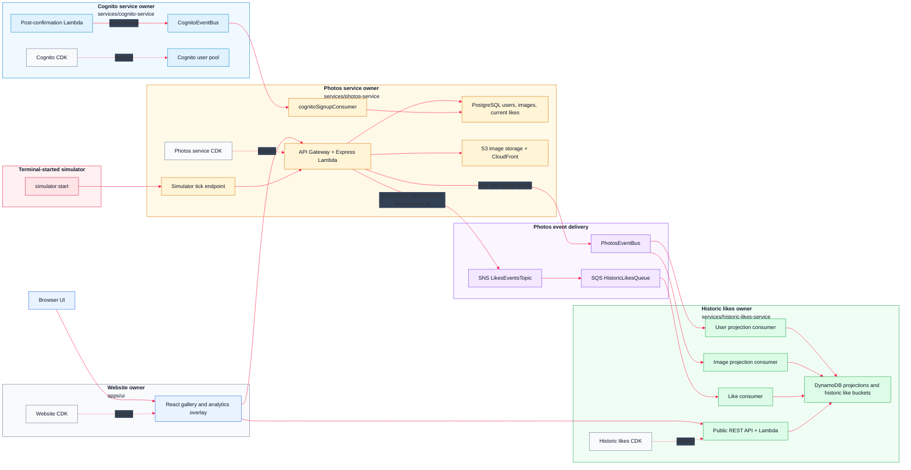

# AWS 07 - Historic Likes Microservice

This reworked version folds the original historic likes course and the later backend ownership refactor into one natural lesson. It introduces the full historic likes architecture, but starts from the independently deployable microservice layout: every service or app owns its runtime code, operational scripts, and CDK infrastructure.

Realtime likes are deliberately not included here. They first appear in AWS 08.

## Architecture



## What This Version Teaches

This version combines the useful work from the original AWS 07 historic likes sequence and the later backend ownership refactor:

- gallery like and unlike buttons backed by Postgres
- typed domain events in `packages/events`
- a photos-owned EventBridge bus for user and image projection events
- SNS fan-out for like events
- SQS queues between event delivery and Lambda consumers
- a separate historic likes service with DynamoDB read models
- a public historic likes API for browser charts
- a terminal-driven like simulator
- a full-screen gallery analytics overlay
- independently deployable services and app-owned CDK
- service-owned deployment, reset, seed, and test scripts

The old `api` or `core-service` naming has been repatriated into `photos-service`. The photos service owns photos, users, current likes, S3 image storage, the RDS schema, the simulator, and the outbound photos event stream.

## Deployable Owners

| Owner | Path | Owns |
| --- | --- | --- |
| Website app | `monorepo/apps/ui` | React UI, website hosting CDK, env generation, build and upload scripts |
| Cognito service | `monorepo/services/cognito-service` | Cognito user pool, hosted UI domain, post-confirmation Lambda, Cognito event bus, Cognito reset |
| Photos service | `monorepo/services/photos-service` | Express API, RDS, S3, image CloudFront distribution, photos event bus, SNS likes topic, Cognito signup ingest, seed, simulator, API tests |
| Historic likes service | `monorepo/services/historic-likes-service` | DynamoDB projections, historic like aggregates, SQS consumers, public historic likes API, historic reset and API tests |
| Shared events | `monorepo/packages/events` | Cross-service event source, detail type, and payload contracts |

Every deployable owner has its own `cdk` folder. There is no central root CDK app.

```text
monorepo/apps/ui/cdk
monorepo/services/cognito-service/cdk
monorepo/services/photos-service/cdk
monorepo/services/historic-likes-service/cdk
```

## Event Model

The system uses two EventBridge buses and one SNS topic because the message flows have different ownership and delivery needs.

**Cognito signup events**

```text
Cognito post-confirmation Lambda
  -> CognitoEventBus
    -> CognitoSignupQueue
      -> photos-service cognitoSignupConsumer
        -> Postgres registered_user
```

Cognito owns authentication and publishes `user.created` with source `uptick.cognito`. The photos service owns the Postgres write model, so it consumes the event and inserts or updates `registered_user`.

**Photos projection events**

```text
photos-service
  -> PhotosEventBus
    -> historic-likes user projection queue
    -> historic-likes image projection queue
      -> DynamoDB read models
```

The photos service publishes projection events with source `uptick.photos`:

```text
user.created
user.updated
user.deleted
image.created
image.updated
image.deleted
```

The historic likes service builds DynamoDB user and image projections from that stream. Those projections let the analytics service understand authors and photos without reaching back into the photos service database.

**Like events**

```text
photos-service
  -> SNS LikesEventsTopic
    -> SQS HistoricLikesQueue
      -> historic-likes like consumer
        -> DynamoDB aggregate tables
```

Like events use SNS because later versions can subscribe more independent services to the same stream. In AWS 07 there is one subscriber: the historic likes service.

The like event types are:

```text
like.created
like.deleted
likes.deleted.all
```

## Data Ownership

**Photos service Postgres tables**

```text
registered_user
images
image_likes
```

Postgres is the source of truth for users known to the app, uploaded image metadata, and the current like state.

`image_likes` stores the current relationship between a user and a photo:

```sql
CREATE TABLE IF NOT EXISTS image_likes (
    user_sub VARCHAR(255) NOT NULL,
    image_id INT NOT NULL,
    created_at TIMESTAMP DEFAULT CURRENT_TIMESTAMP,
    PRIMARY KEY (user_sub, image_id)
);
```

**Historic likes DynamoDB tables**

```text
UsersProjectionTable
ImagesProjectionTable
HistoricPhotoBucketLikes
HistoricAuthorBucketLikes
```

The projection tables hold the latest user and image read models. The aggregate tables hold sparse historic like buckets for images and authors.

## Service APIs

### Photos service

The photos service is an Express app adapted to Lambda with `@codegenie/serverless-express`.

Public routes:

```text
GET    /public/health
GET    /public/gallery-photos
GET    /public/images/:imageId
POST   /public/simulation/tick
DELETE /public/simulation/likes
```

Authenticated routes:

```text
GET  /auth/photos/gallery
POST /auth/photos/presigned-url
POST /auth/photos/:imageId/like
GET  /auth/users/me
PUT  /auth/users/me/nickname
GET  /auth/admin/member
DELETE /auth/admin/photos
```

Anonymous users use `GET /public/gallery-photos`. Signed-in users use `GET /auth/photos/gallery`, which adds `likedByCurrentUser` to each photo where appropriate.

Toggling a like uses:

```text
POST /auth/photos/{imageId}/like
```

It returns the new current state:

```json
{
  "liked": true
}
```

The toggle writes to Postgres inside a transaction. After the transaction commits, the photos service publishes a `like.created` or `like.deleted` event to SNS.

### Historic likes service

The historic likes service intentionally does not use Express. It has a small direct Lambda handler behind API Gateway.

Public routes:

```text
GET /public/health
GET /public/photo-likes?imageId=<image-id>
GET /public/author-likes?userId=<author-user-id>
```

`photoId` is accepted as an alias for `imageId`. `authorUserId` is accepted as an alias for `userId`.

With an ID, each endpoint returns chart data for one photo or one author. The response includes a fixed window of buckets, filling missing buckets with zero so the UI can render stable charts:

```json
{
  "imageId": "1",
  "minutes": [
    {
      "offsetMinutes": 14,
      "label": "T-14 minutes",
      "minuteBucket": "2026-06-10T14:23Z",
      "likes": 0
    }
  ]
}
```

Without an ID, the endpoints return an activity report across all photos or authors for diagnostics and terminal reporting.

## UI Behaviour

The UI keeps the original gallery workflow and adds historic analytics:

- anonymous users can browse and search photos
- signed-in users can like and unlike photos
- the gallery shows a heart button only for signed-in users
- a filled heart means the current user has liked the photo
- upload and profile links appear only when signed in
- each gallery tile has an analytics icon
- clicking the analytics icon opens a full-screen overlay
- the overlay shows historic author and image charts for the selected photo
- charts call the historic likes API directly and do not require Cognito

The overlay uses the selected image as a faded background and renders plain SVG charts. The historic likes API fills missing buckets, so the UI always receives a consistent chart shape.

## Seed Data

Seed photos live at the repository root:

```text
photos-to-upload
```

The seed script is owned by the photos service:

```text
monorepo/services/photos-service/scripts/src/init-images.ts
```

It:

1. reads the image bucket name from SSM at `/photos/images/bucket-name`
2. reads local files from `../photos-to-upload` relative to the repository root through the service script default
3. creates seed users
4. uploads photos to S3
5. inserts or updates rows in Postgres
6. publishes matching `user.created` and `image.created` events to `PhotosEventBus`

The reworked seed model creates artwork authors and simulator viewers. Artwork is assigned to `author-*` users, and simulator activity uses `viewer-*` users.

Run seeding from the monorepo:

```bash
cd monorepo
pnpm run data:seed
```

Override the photo folder if needed:

```bash
PHOTOS_DIR=/absolute/path/to/photos pnpm -C services/photos-service run data:seed
```

## Simulator

The simulator creates realistic historic like activity without using the browser.

Start it from the monorepo:

```bash
pnpm run simulator:start
```

The script:

1. clears current Postgres likes by calling the simulator reset endpoint
2. publishes a `likes.deleted.all` event
3. calls `POST /public/simulation/tick` every few seconds
4. creates likes for random unliked viewer/photo pairs
5. stops when the tick limit is reached or no unliked pairs remain

Inspect the latest simulator data:

```bash
pnpm -C services/photos-service run simulator:latest
```

Use `data:reset` when you want to clear the full deployed environment. Use `simulator:start` when you only want fresh like activity.

## SSM Parameters

The deployed services communicate through service-owned SSM parameters:

```text
/photos/events/event-bus-name
/photos/events/likes-topic-arn
/photos/images/bucket-name
/photos/images/distribution-url
/photos/rds/secret-arn
/photos/cognito-signup/queue-url

/cognito/domain
/cognito/client-id
/cognito/user-pool-id
/cognito/events/event-bus-name

/historic-likes/users-table-name
/historic-likes/images-table-name
/historic-likes/photo-bucket-likes-table-name
/historic-likes/author-bucket-likes-table-name
/historic-likes/queue-url

/services/photos-service/base-url
/services/historic-likes-service/base-url
```

The UI env generation script reads the public service URLs and Cognito settings from SSM and writes `monorepo/apps/ui/.env`.

## Run The Full Version

From the repository root:

```bash
cd monorepo
pnpm install
pnpm run deploy-everything
pnpm run data:seed
```

`deploy-everything`:

1. deploys website hosting infrastructure from `apps/ui/cdk`
2. deploys Cognito and the post-confirmation trigger from `services/cognito-service/cdk`
3. deploys `photos-service-stack` from `services/photos-service/cdk`, then runs Flyway migrations
4. deploys `historic-likes-service-stack` from `services/historic-likes-service/cdk`
5. deploys the website UI

Deploy Cognito before the photos service. The photos service imports `/cognito/user-pool-id` and `/cognito/events/event-bus-name`.

The photos service stack is the slow step on a cold account because it creates Aurora and CloudFront resources. Allow 30 to 45 minutes.

After deployment:

```bash
pnpm run type-check
pnpm -C services/photos-service run test:security
pnpm -C services/historic-likes-service run test:public-api
pnpm run ui:url
```

## Independent Service Commands

Deploy one service or app:

```bash
pnpm run cognito-service:deploy
pnpm run photos-service:deploy
pnpm run historic-likes-service:deploy
pnpm run website:deploy
```

Destroy one service or app:

```bash
pnpm run website:destroy
pnpm run historic-likes-service:destroy
pnpm run photos-service:destroy
pnpm run cognito-service:destroy
```

Service-local commands:

```bash
pnpm -C services/photos-service run database:migrate
pnpm -C services/photos-service run database:reset
pnpm -C services/photos-service run data:seed
pnpm -C services/photos-service run data:reset
pnpm -C services/historic-likes-service run data:reset
pnpm -C services/cognito-service run data:reset
```

Run the UI locally against deployed services:

```bash
pnpm -C apps/ui run generate-env
pnpm -C apps/ui run dev
```

Deploy only the UI after frontend changes:

```bash
pnpm -C apps/ui run generate-env
pnpm run website:deploy
```

Clean package artifacts:

```bash
pnpm run package-cleanup
```

Destroy everything:

```bash
pnpm run destroy-everything
```

## Data Reset

Reset deployed data back to a clean baseline:

```bash
pnpm run data:reset
pnpm run data:seed
```

`data:reset` delegates to service-owned reset scripts:

1. **photos service** migrates Postgres, clears `image_likes`, `images`, and `registered_user`, restores the `system` user, and empties the image bucket.
2. **historic likes service** purges the likes queue and clears DynamoDB projection and aggregate tables.
3. **cognito service** deletes Cognito users.

The reset path does not reseed automatically. Run `pnpm run data:seed` after reset.

If you need the script-managed Cognito test users recreated, run:

```bash
pnpm -C services/photos-service run test:security
```

## Expected Behaviour

- Each deployable owner has its own CDK folder.
- The root package delegates deployment, destroy, reset, and test commands to owner packages.
- Cognito sign-up creates app users through the event path, not through a direct Postgres write in the Cognito trigger.
- The public gallery shows seeded artwork owned by `author-*` users.
- Anonymous users can browse and open historic analytics.
- Signed-in users can like and unlike photos.
- Current like state is stored in Postgres.
- The photos service publishes user and image projection events to `PhotosEventBus`.
- The photos service publishes like events to SNS.
- The historic likes service consumes projection events and like events into DynamoDB.
- The public historic API returns chart data without Cognito.
- The analytics overlay shows author and image historic likes.
- `simulator:start` generates historic activity for the charts.
- `pnpm run data:reset` followed by `pnpm run data:seed` returns the environment to the post-deploy baseline.
- `pnpm run type-check` passes.

## Troubleshooting

If deployment fails because an old stack still exists, delete the older CloudFormation stacks manually before redeploying. This reworked version expects owner-local stacks:

```text
website-stack
cognito-post-confirmation-stack
cognito-stack
photos-service-stack
historic-likes-service-stack
```

Older snapshots used names such as `api-stack`, `core-service-stack`, `events-stack`, `images-stack`, or `rds-stack`.

If the UI has stale service URLs, regenerate env values and redeploy the website:

```bash
pnpm -C apps/ui run generate-env
pnpm run website:deploy
```

If the gallery is empty after a reset, run:

```bash
pnpm run data:seed
```

If charts stay flat, run the simulator and wait for events to move through SNS, SQS, Lambda, and DynamoDB:

```bash
pnpm run simulator:start
```

## Source Material Folded Into This Version

This reworked lesson synthesizes the content that originally appeared across:

- `aws07-historic-likes-microservice/00-starting-point`
- `aws07-historic-likes-microservice/01-ui-like-buttons`
- `aws07-historic-likes-microservice/02-api-eventbridge-projection-events`
- `aws07-historic-likes-microservice/03-historic-service-eventbridge-projections`
- `aws07-historic-likes-microservice/04-publish-like-sns-events`
- `aws07-historic-likes-microservice/05-consume-like-sqs-events`
- `aws07-historic-likes-microservice/06-like-simulator`
- `aws07-historic-likes-microservice/07-historic-likes-api`
- `aws07-historic-likes-microservice/08-ui-historic-analytics`
- `aws07-historic-likes-microservice/09-independent-microservices`
- `aws09-backend-microservice-ownership/01-service-owned-infrastructure`

The current version keeps the learning content, but updates names and paths to the reworked architecture: `photos-service`, `PhotosEventBus`, `/photos/...` SSM parameters, owner-local CDK folders, and no realtime likes service.
